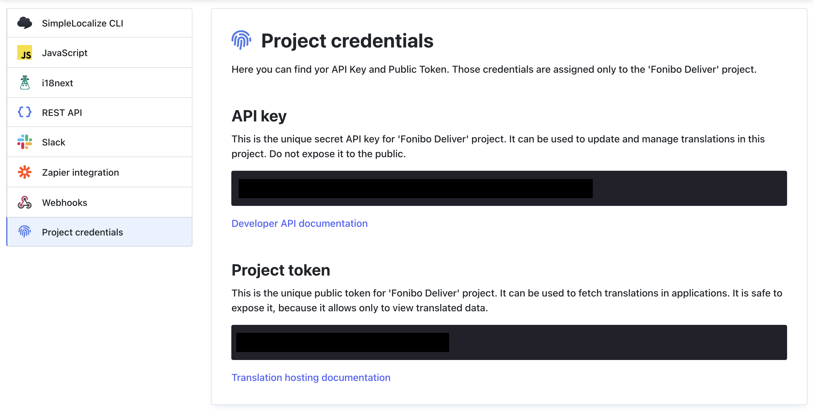

# SimpleLocalize

[Simplelocalize.io](https://simplelocalize.io/) CLI for dart / flutter projects.

## Getting started

### 1. Install

Install by adding a few lines to `pubspec.yaml`.

```yaml
dev_dependencies:
  simplelocalize: ^0.2.0
```

Check [installing](https://pub.dev/packages/simplelocalize/install) section for more details.

### 2. Configure

Go to your [simplelocalize dashboard](https://simplelocalize.io/dashboard/projects/) and select project then Credentials > Project credentails.



```yaml
simplelocalize:
  project_token: # Project token
  api_key: # API key
  directory: lib/l10n
  filename: "{1}.arb"
  format: arb
```

### 3. Download localizations

Use simplelocalize CLI tool to download l10ns for defined project on `pubspec.yaml`.

```shell
flutter pub run simplelocalize download
```
